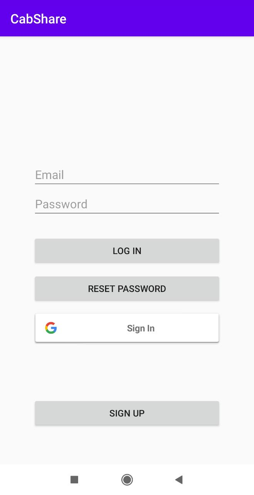
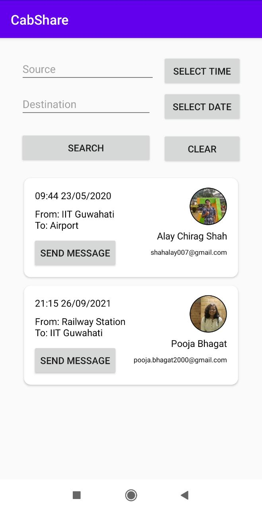
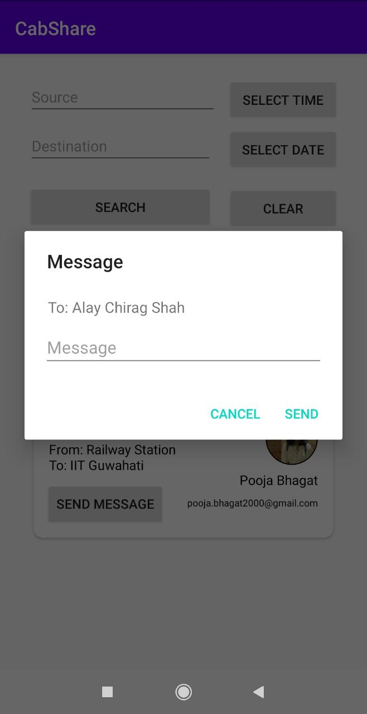
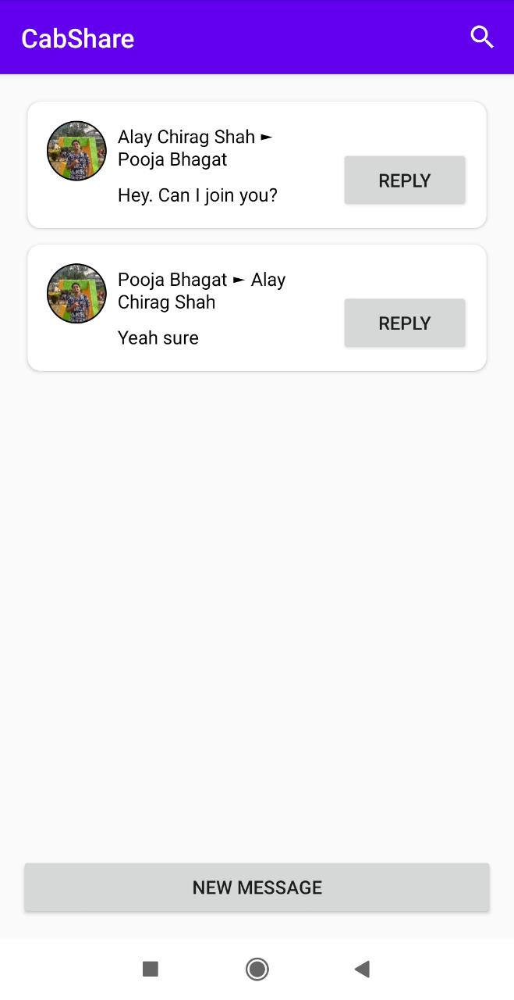
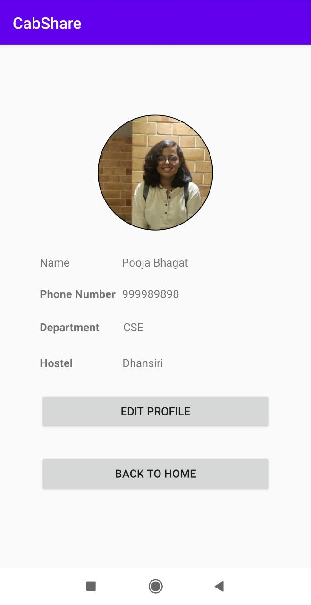

# Cab Sharing Application
 
A project in collaboration with Coding Club, IIT Guwahati. 
 
Contributors: Pooja Bhagat | Alay Shah
 

The project intended to fecilitate the process of finding people to share a cab with for the campus residents of IIT, Guwahati formerly done on a facebook group. 

### Features
 * Login and sign-up : Manual + Google Authenticated 
* Updatable Profile
* Adding Trips : Source, Destination, Time and Date of leaving 
* Filtered Trip Search : Time, Source and Destination constraints 
* Inbuilt Messaging Feature : Through Email and Trip Card 

### TO-DO
* Outlook Authentication
* Deletion and Modification of Trip Details

### Screens

Login

Add Trip

Search Trip

Messaging

Profile

